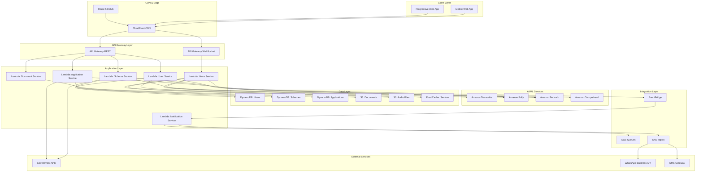
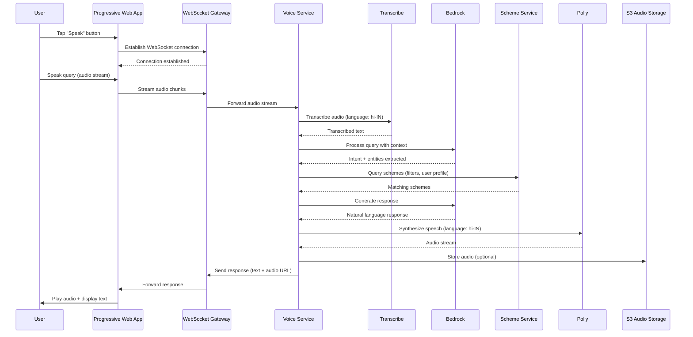
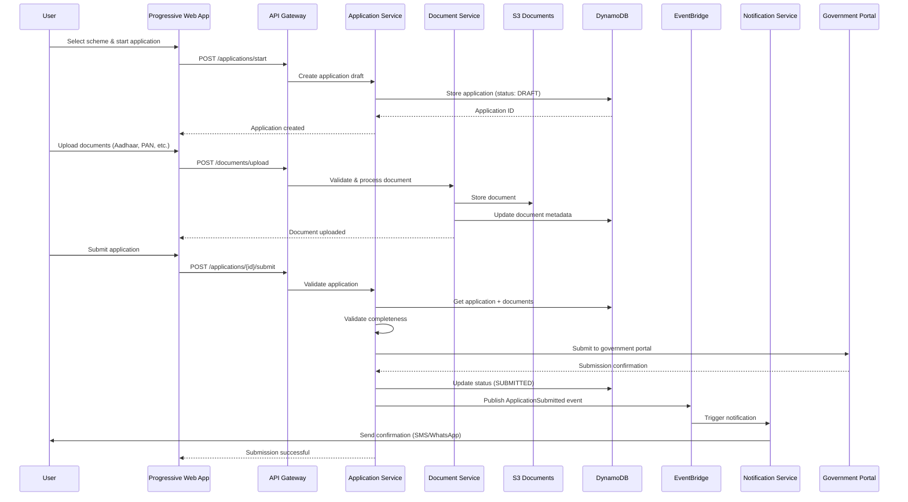

# Design Document: Voice for Bharat

## Overview

Voice for Bharat is a voice-first, AI-powered application designed to democratize access to government welfare information across India. The platform addresses the digital divide by providing multilingual voice interaction capabilities, enabling citizens with varying levels of digital literacy to discover, understand, and apply for government welfare schemes. The system combines a visual dashboard for tracking applications and saved schemes with an intelligent voice assistant that can converse in multiple Indian languages, providing personalized scheme recommendations based on user profiles and eligibility criteria.

The application leverages AWS infrastructure for scalability, reliability, and cost-effectiveness, utilizing services such as Amazon Polly for text-to-speech, Amazon Transcribe for speech-to-text, Amazon Bedrock for AI-powered conversational intelligence, DynamoDB for user data storage, S3 for document management, and CloudFront for content delivery. The architecture is designed to handle millions of concurrent users across diverse geographic locations while maintaining low latency and high availability.

The platform serves as a bridge between government welfare programs and citizens, featuring real-time application tracking, document verification workflows, state-specific scheme filtering, and 24/7 multilingual support through voice, chat, and WhatsApp channels.

## Architecture



## Sequence Diagrams

### Voice Interaction Flow



### Application Submission Flow



## Components and Interfaces

### Component 1: Voice Service

**Purpose**: Orchestrates voice interaction flow including speech-to-text, natural language understanding, and text-to-speech conversion.

**Interface**:
```pascal
INTERFACE VoiceService
  PROCEDURE processVoiceQuery(audioStream, sessionId, language)
  PROCEDURE synthesizeSpeech(text, language, voiceId)
  PROCEDURE getConversationHistory(sessionId)
  PROCEDURE endConversation(sessionId)
END INTERFACE
```

**Responsibilities**:
- Stream audio to Amazon Transcribe for real-time transcription
- Maintain conversation context in ElastiCache
- Integrate with Bedrock for intent recognition and response generation
- Convert text responses to speech using Amazon Polly
- Handle language switching mid-conversation
- Manage WebSocket connections for real-time communication

### Component 2: Scheme Service

**Purpose**: Manages government welfare scheme data, eligibility matching, and personalized recommendations.

**Interface**:
```pascal
INTERFACE SchemeService
  PROCEDURE searchSchemes(query, filters, userProfile)
  PROCEDURE getSchemeDetails(schemeId, language)
  PROCEDURE checkEligibility(schemeId, userProfile)
  PROCEDURE getRecommendations(userProfile, state)
  PROCEDURE syncSchemeData(source)
END INTERFACE
```

**Responsibilities**:
- Query and filter schemes based on state, category, and eligibility
- Calculate eligibility scores using user profile data
- Generate personalized recommendations using AI
- Sync scheme data from government APIs
- Provide multilingual scheme descriptions
- Cache frequently accessed schemes

### Component 3: Application Service

**Purpose**: Manages the complete application lifecycle from draft creation to submission and tracking.

**Interface**:
```pascal
INTERFACE ApplicationService
  PROCEDURE createApplication(userId, schemeId)
  PROCEDURE updateApplication(applicationId, data)
  PROCEDURE submitApplication(applicationId)
  PROCEDURE getApplicationStatus(applicationId)
  PROCEDURE listUserApplications(userId, filters)
  PROCEDURE trackApplicationProgress(applicationId)
END INTERFACE
```

**Responsibilities**:
- Create and manage application drafts
- Validate application completeness before submission
- Submit applications to government portals via APIs
- Track application status and sync updates
- Generate application reports and summaries
- Handle application withdrawals and modifications


### Component 4: User Service

**Purpose**: Manages user profiles, authentication, and personalization data.

**Interface**:
```pascal
INTERFACE UserService
  PROCEDURE createUser(phoneNumber, language)
  PROCEDURE updateProfile(userId, profileData)
  PROCEDURE getProfile(userId)
  PROCEDURE calculateProfileStrength(userId)
  PROCEDURE authenticateUser(phoneNumber, otp)
  PROCEDURE getUserPreferences(userId)
END INTERFACE
```

**Responsibilities**:
- Handle user registration and authentication via OTP
- Store and manage user profile data (demographics, documents, preferences)
- Calculate profile strength percentage
- Manage user preferences (language, notification settings)
- Implement privacy controls and data encryption
- Handle user consent for data usage

### Component 5: Document Service

**Purpose**: Handles document upload, validation, storage, and retrieval.

**Interface**:
```pascal
INTERFACE DocumentService
  PROCEDURE uploadDocument(userId, documentType, file)
  PROCEDURE validateDocument(documentId)
  PROCEDURE getDocument(documentId)
  PROCEDURE listUserDocuments(userId)
  PROCEDURE deleteDocument(documentId)
  PROCEDURE extractDocumentData(documentId)
END INTERFACE
```

**Responsibilities**:
- Upload documents to S3 with encryption
- Validate document types and formats
- Extract data from documents using OCR (Textract)
- Generate presigned URLs for secure document access
- Implement document retention policies
- Manage document versioning

### Component 6: Notification Service

**Purpose**: Sends notifications across multiple channels (SMS, WhatsApp, Push, Email).

**Interface**:
```pascal
INTERFACE NotificationService
  PROCEDURE sendNotification(userId, message, channels)
  PROCEDURE sendBulkNotifications(userIds, message, channels)
  PROCEDURE scheduleNotification(userId, message, scheduledTime)
  PROCEDURE getNotificationHistory(userId)
  PROCEDURE updateNotificationPreferences(userId, preferences)
END INTERFACE
```

**Responsibilities**:
- Send notifications via SNS (SMS, Email, Push)
- Integrate with WhatsApp Business API
- Queue notifications for batch processing
- Track notification delivery status
- Respect user notification preferences
- Handle notification retries and failures


## Data Models

### Model 1: User

```pascal
STRUCTURE User
  userId: UUID
  phoneNumber: String
  language: String
  profile: UserProfile
  preferences: UserPreferences
  createdAt: Timestamp
  updatedAt: Timestamp
  lastLoginAt: Timestamp
END STRUCTURE

STRUCTURE UserProfile
  name: String
  dateOfBirth: Date
  gender: String
  state: String
  district: String
  income: Number
  category: String
  aadhaarNumber: String
  panNumber: String
  bankAccount: BankDetails
  documents: List<DocumentReference>
END STRUCTURE

STRUCTURE UserPreferences
  notificationChannels: List<String>
  preferredLanguage: String
  voiceSpeed: Number
  autoPlayAudio: Boolean
END STRUCTURE

STRUCTURE BankDetails
  accountNumber: String
  ifscCode: String
  bankName: String
  verified: Boolean
END STRUCTURE
```

**Validation Rules**:
- phoneNumber must be valid 10-digit Indian mobile number
- language must be one of supported languages (en, hi, mr, kn, ta, etc.)
- aadhaarNumber must be 12 digits (if provided)
- panNumber must match PAN format (if provided)
- income must be non-negative number
- state must be valid Indian state code

**DynamoDB Schema**:
- Partition Key: userId
- GSI1: phoneNumber (for authentication lookup)
- GSI2: state + category (for analytics and targeting)


### Model 2: Scheme

```pascal
STRUCTURE Scheme
  schemeId: UUID
  name: Map<String, String>
  description: Map<String, String>
  state: String
  category: String
  eligibilityCriteria: EligibilityCriteria
  benefits: Map<String, String>
  applicationProcess: Map<String, List<String>>
  requiredDocuments: List<String>
  portalUrl: String
  portalStatus: String
  lastSyncedAt: Timestamp
  isActive: Boolean
END STRUCTURE

STRUCTURE EligibilityCriteria
  minAge: Number
  maxAge: Number
  gender: List<String>
  incomeLimit: Number
  categories: List<String>
  states: List<String>
  customRules: List<Rule>
END STRUCTURE

STRUCTURE Rule
  field: String
  operator: String
  value: Any
  logicalOperator: String
END STRUCTURE
```

**Validation Rules**:
- schemeId must be unique
- name and description must have at least one language entry
- state must be valid Indian state code or "ALL_INDIA"
- category must be from predefined list (education, health, agriculture, etc.)
- minAge must be less than maxAge
- incomeLimit must be non-negative
- portalStatus must be one of: ACTIVE, MAINTENANCE, OFFLINE

**DynamoDB Schema**:
- Partition Key: schemeId
- GSI1: state + category (for filtering)
- GSI2: isActive + lastSyncedAt (for sync operations)


### Model 3: Application

```pascal
STRUCTURE Application
  applicationId: UUID
  userId: UUID
  schemeId: UUID
  status: String
  formData: Map<String, Any>
  documents: List<DocumentReference>
  submittedAt: Timestamp
  lastUpdatedAt: Timestamp
  externalReferenceId: String
  statusHistory: List<StatusChange>
  notes: String
END STRUCTURE

STRUCTURE DocumentReference
  documentId: UUID
  documentType: String
  s3Key: String
  uploadedAt: Timestamp
  verified: Boolean
END STRUCTURE

STRUCTURE StatusChange
  status: String
  timestamp: Timestamp
  reason: String
  updatedBy: String
END STRUCTURE
```

**Validation Rules**:
- status must be one of: DRAFT, SUBMITTED, UNDER_REVIEW, APPROVED, REJECTED, WITHDRAWN
- userId and schemeId must reference valid entities
- documents must include all required documents for the scheme
- formData must satisfy scheme-specific validation rules
- submittedAt must be set only when status is SUBMITTED or later

**DynamoDB Schema**:
- Partition Key: applicationId
- GSI1: userId + status (for user's application list)
- GSI2: schemeId + submittedAt (for scheme analytics)


### Model 4: ConversationSession

```pascal
STRUCTURE ConversationSession
  sessionId: UUID
  userId: UUID
  language: String
  messages: List<Message>
  context: ConversationContext
  startedAt: Timestamp
  lastActivityAt: Timestamp
  isActive: Boolean
END STRUCTURE

STRUCTURE Message
  messageId: UUID
  role: String
  content: String
  audioUrl: String
  timestamp: Timestamp
  metadata: Map<String, Any>
END STRUCTURE

STRUCTURE ConversationContext
  currentIntent: String
  entities: Map<String, Any>
  selectedScheme: UUID
  conversationState: String
  userPreferences: Map<String, Any>
END STRUCTURE
```

**Validation Rules**:
- role must be one of: USER, ASSISTANT, SYSTEM
- language must be supported language code
- isActive must be false if lastActivityAt is older than 30 minutes
- messages must be ordered by timestamp

**Storage**: ElastiCache (Redis) for active sessions, DynamoDB for historical sessions

### Model 5: Helpline

```pascal
STRUCTURE Helpline
  helplineId: UUID
  name: Map<String, String>
  phoneNumber: String
  category: String
  state: String
  availability: String
  languages: List<String>
  description: Map<String, String>
  isActive: Boolean
  createdAt: Timestamp
  updatedAt: Timestamp
END STRUCTURE
```

**Validation Rules**:
- phoneNumber must be valid Indian phone number format (10 digits or toll-free)
- state must be valid Indian state code or "ALL_INDIA"
- category must be from predefined list (welfare, health, emergency, agriculture, education)
- languages must be subset of supported languages (en, hi, mr, kn, ta, te)
- availability must describe hours (e.g., "24/7", "9 AM - 6 PM", "Mon-Fri 9-5")

**DynamoDB Schema**:
- Partition Key: helplineId
- GSI1: state + category (for filtering helplines by state and category)
- GSI2: isActive + state (for active helplines by state)

### Model 6: GuideContent

```pascal
STRUCTURE GuideContent
  contentId: UUID
  category: String
  state: String
  question: Map<String, String>
  answer: Map<String, String>
  priority: Number
  tags: List<String>
  relatedSchemes: List<UUID>
  viewCount: Number
  lastUpdatedAt: Timestamp
  isActive: Boolean
END STRUCTURE
```

**Validation Rules**:
- category must be one of: quick-guide, faq, tutorial, troubleshooting
- state must be valid Indian state code or "ALL_INDIA"
- question and answer must have at least one language entry
- priority must be between 1-100 (higher = more important)
- tags must be non-empty list for searchability

**DynamoDB Schema**:
- Partition Key: contentId
- GSI1: category + state + priority (DESC) (for quick guide queries)
- GSI2: state + lastUpdatedAt (for content management)
- GSI3: category + viewCount (DESC) (for popular content)

### Model 7: SuggestedQuery

```pascal
STRUCTURE SuggestedQuery
  queryId: UUID
  text: Map<String, String>
  category: String
  state: String
  intent: String
  entities: Map<String, Any>
  popularity: Number
  displayOrder: Number
  isActive: Boolean
  lastUpdatedAt: Timestamp
END STRUCTURE
```

**Validation Rules**:
- text must have entries for all supported languages
- category must be from predefined list (ration-card, health, agriculture, education, pension)
- state must be valid Indian state code or "ALL_INDIA"
- intent must match voice service intent types
- popularity must be non-negative number (incremented on use)
- displayOrder determines position in suggested questions list

**DynamoDB Schema**:
- Partition Key: queryId
- GSI1: state + displayOrder (ASC) (for displaying suggested questions)
- GSI2: category + popularity (DESC) (for analytics)
- GSI3: isActive + state (for active queries by state)


## Algorithmic Pseudocode

### Main Voice Processing Algorithm

```pascal
ALGORITHM processVoiceQuery(audioStream, sessionId, language)
INPUT: audioStream (binary audio data), sessionId (UUID), language (String)
OUTPUT: response (VoiceResponse containing text and audio URL)

BEGIN
  ASSERT audioStream IS NOT NULL
  ASSERT sessionId IS VALID UUID
  ASSERT language IN SUPPORTED_LANGUAGES
  
  // Step 1: Retrieve or create conversation session
  session ← getOrCreateSession(sessionId, language)
  ASSERT session.isActive = TRUE
  
  // Step 2: Transcribe audio to text
  transcriptionResult ← transcribeAudio(audioStream, language)
  ASSERT transcriptionResult.confidence > CONFIDENCE_THRESHOLD
  
  userText ← transcriptionResult.text
  
  // Step 3: Update conversation history
  userMessage ← createMessage("USER", userText, audioStream.url)
  session.messages.append(userMessage)
  session.lastActivityAt ← getCurrentTimestamp()
  
  // Step 4: Extract intent and entities using AI
  nlpResult ← processNaturalLanguage(userText, session.context, language)
  session.context.currentIntent ← nlpResult.intent
  session.context.entities ← mergeEntities(session.context.entities, nlpResult.entities)
  
  // Step 5: Execute intent-specific logic
  responseText ← ""
  
  IF nlpResult.intent = "SEARCH_SCHEMES" THEN
    schemes ← searchSchemes(nlpResult.entities, session.userId)
    responseText ← generateSchemeListResponse(schemes, language)
    session.context.conversationState ← "SHOWING_SCHEMES"
    
  ELSE IF nlpResult.intent = "CHECK_ELIGIBILITY" THEN
    schemeId ← nlpResult.entities["scheme_id"]
    userProfile ← getUserProfile(session.userId)
    eligibility ← checkEligibility(schemeId, userProfile)
    responseText ← generateEligibilityResponse(eligibility, language)
    session.context.conversationState ← "ELIGIBILITY_CHECKED"
    
  ELSE IF nlpResult.intent = "START_APPLICATION" THEN
    schemeId ← nlpResult.entities["scheme_id"]
    application ← createApplication(session.userId, schemeId)
    responseText ← generateApplicationStartResponse(application, language)
    session.context.conversationState ← "APPLICATION_STARTED"
    
  ELSE IF nlpResult.intent = "GET_STATUS" THEN
    applications ← getUserApplications(session.userId)
    responseText ← generateStatusResponse(applications, language)
    session.context.conversationState ← "STATUS_SHOWN"
    
  ELSE
    responseText ← generateFallbackResponse(language)
  END IF
  
  // Step 6: Synthesize speech from response text
  audioUrl ← synthesizeSpeech(responseText, language, session.voicePreferences)
  
  // Step 7: Update conversation history with assistant response
  assistantMessage ← createMessage("ASSISTANT", responseText, audioUrl)
  session.messages.append(assistantMessage)
  
  // Step 8: Persist session state
  saveSession(session)
  
  // Step 9: Return response
  response ← VoiceResponse(responseText, audioUrl, session.context)
  
  ASSERT response.text IS NOT EMPTY
  ASSERT response.audioUrl IS VALID URL
  
  RETURN response
END
```

**Preconditions:**
- audioStream contains valid audio data in supported format (WAV, MP3, OGG)
- sessionId is a valid UUID (new or existing session)
- language is one of the supported languages
- AWS services (Transcribe, Bedrock, Polly) are available
- User session data is accessible in ElastiCache or DynamoDB

**Postconditions:**
- Returns VoiceResponse with both text and audio URL
- Conversation session is updated with new messages
- Session context reflects current conversation state
- Audio response is stored in S3 and accessible via URL
- All state changes are persisted to database

**Loop Invariants:** N/A (no explicit loops in main algorithm)


## Dashboard MVP Specifications

### Dashboard Overview

The dashboard provides users with a comprehensive view of their welfare scheme journey, featuring a gradient header, state/language selectors, three-tab navigation (Dashboard, Assistant, Guide), metric cards, status items, quick guide summary, and a prominent voice assistant CTA. The interface is mobile-first with a responsive grid layout optimized for touch interactions.

### Header Component

```pascal
STRUCTURE DashboardHeader
  title: String = "IN VOICE FOR BHARAT"
  subtitle: String = "NATIONAL DIGITAL INCLUSION PROJECT"
  gradient: String = "orange-to-green"
  helpIcon: Boolean = TRUE
  stateDropdown: StateSelector
  languageDropdown: LanguageSelector
END STRUCTURE

STRUCTURE StateSelector
  defaultValue: String = "Other"
  options: List<String> = [
    "Andhra Pradesh",
    "Telangana",
    "Karnataka",
    "Tamil Nadu",
    "Kerala",
    "Maharashtra",
    "Uttar Pradesh",
    "Bihar",
    "West Bengal",
    "Gujarat",
    "Other"
  ]
END STRUCTURE

STRUCTURE LanguageSelector
  defaultValue: String = "English"
  options: List<String> = ["English", "Hindi", "Marathi", "Kannada", "Tamil", "Telugu"]
END STRUCTURE
```

### Tab Navigation

```pascal
STRUCTURE TabNavigation
  tabs: List<Tab> = [
    Tab(icon: "🏠", label: "DASHBOARD", route: "/dashboard"),
    Tab(icon: "🎤", label: "ASSISTANT", route: "/assistant"),
    Tab(icon: "📖", label: "GUIDE", route: "/guide")
  ]
  activeTab: String = "DASHBOARD"
  activeColor: String = "orange"
END STRUCTURE
```

### Dashboard Cards (2-Column Grid)

#### Card 1: Active Schemes

```pascal
STRUCTURE ActiveSchemesCard
  title: String = "ACTIVE SCHEMES"
  count: Number = 03
  backgroundColor: String = "light-blue"
  icon: String = "schemes-icon"
  action: NavigationLink = "/schemes"
END STRUCTURE
```

**Data Source**: DynamoDB `schemes` table
**Query**: `state = {selectedState} AND isActive = TRUE`
**Update Frequency**: On state change + daily sync

#### Card 2: Helplines

```pascal
STRUCTURE HelplinesCard
  title: String = "HELPLINES"
  count: Number = 03
  backgroundColor: String = "light-orange"
  icon: String = "phone-icon"
  action: NavigationLink = "/helplines"
END STRUCTURE
```

**Data Source**: Static configuration + DynamoDB `helplines` table
**Query**: `state = {selectedState} OR state = 'ALL_INDIA'`
**Update Frequency**: On state change

### Status Items Section

```pascal
STRUCTURE StatusItemsSection
  items: List<StatusItem>
END STRUCTURE

STRUCTURE StatusItem
  id: String
  icon: String
  iconColor: String
  title: String
  description: String
  action: StatusAction
END STRUCTURE

STRUCTURE StatusAction
  VARIANT ViewButton(label: String, link: String)
  VARIANT StatusBadge(label: String, color: String)
END STRUCTURE
```

**Status Item 1: Ration Card Status**
```pascal
SEQUENCE
  item1 ← StatusItem(
    id: "ration-card-status",
    icon: "🎫",
    iconColor: "yellow",
    title: "Ration Card Status",
    description: "Verified via National Portal",
    action: ViewButton("VIEW", "/ration-card")
  )
END SEQUENCE
```

**Status Item 2: Aadhaar Seeding**
```pascal
SEQUENCE
  item2 ← StatusItem(
    id: "aadhaar-seeding",
    icon: "🆔",
    iconColor: "purple",
    title: "Aadhaar Seeding",
    description: "Required for most benefits",
    action: StatusBadge("ACTIVE", "green")
  )
END SEQUENCE
```

**Data Source**: DynamoDB `user_profile` table + external API verification
**Update Frequency**: Real-time on user action + daily verification check

### Quick Guide Summary Section

```pascal
STRUCTURE QuickGuideSummary
  title: String = "QUICK GUIDE SUMMARY"
  questions: List<GuideQuestion>
END STRUCTURE

STRUCTURE GuideQuestion
  id: String
  question: String
  answer: String
END STRUCTURE
```

**Sample Data**:
```pascal
SEQUENCE
  question1 ← GuideQuestion(
    id: "bpl-eligibility",
    question: "Who is eligible for BPL?",
    answer: "Families with annual income below state-specific thresholds (usually ₹27,000 - ₹1.2L)."
  )
  
  question2 ← GuideQuestion(
    id: "processing-time",
    question: "How long does it take?",
    answer: "Typical processing time for new Ration Cards is 15-30 days after document verification."
  )
END SEQUENCE
```

**Data Source**: Static configuration + DynamoDB `guide_content` table
**Query**: `category = 'quick-guide' AND state = {selectedState} ORDER BY priority LIMIT 2`
**Update Frequency**: On state change + weekly content updates

### Primary CTA Button

```pascal
STRUCTURE PrimaryCTA
  label: String = "🎤 TALK TO THE ASSISTANT"
  backgroundColor: String = "dark-navy"
  textColor: String = "white"
  height: String = "56px"
  fontSize: String = "18px"
  action: NavigationLink = "/assistant"
  icon: String = "🎤"
END STRUCTURE
```

### Footer Component

```pascal
STRUCTURE DashboardFooter
  links: List<FooterLink> = [
    FooterLink("OFFICIAL DATA ACCESS", "/data-access"),
    FooterLink("PRIVACY", "/privacy"),
    FooterLink("TERMS", "/terms")
  ]
  textColor: String = "gray"
  fontSize: String = "12px"
END STRUCTURE
```

### Dashboard Layout

```pascal
STRUCTURE DashboardLayout
  header: DashboardHeader
  tabNavigation: TabNavigation
  metricsGrid: MetricsGrid
  statusItems: StatusItemsSection
  quickGuide: QuickGuideSummary
  primaryCTA: PrimaryCTA
  footer: DashboardFooter
END STRUCTURE

STRUCTURE MetricsGrid
  layout: String = "grid-cols-2"
  gap: String = "16px"
  cards: List<MetricCard> = [ActiveSchemesCard, HelplinesCard]
END STRUCTURE
```

### Mobile-First Responsive Design

**Breakpoints**:
- Mobile: 320px - 767px (2-column grid for cards)
- Tablet: 768px - 1023px (2-column grid)
- Desktop: 1024px+ (2-column grid with wider spacing)

**Touch Targets**:
- Minimum size: 44x44px
- Card padding: 20px
- Button height: 56px (primary), 48px (secondary)

**Typography**:
- Header title: 18px bold
- Header subtitle: 12px regular
- Tab labels: 14px medium
- Metric numbers: 32px bold
- Card titles: 14px medium uppercase
- Status items: 16px regular
- Quick guide questions: 14px medium
- Quick guide answers: 14px regular
- Footer links: 12px light

**Color Scheme**:
- Header gradient: Orange (#ff6b35) to Green (#4caf50)
- Active tab: Orange (#ff6b35)
- Primary CTA: Dark navy (#1a2332)
- Record button: Orange (#ff6b35)
- Active status badge: Green (#4caf50)
- Card backgrounds: Light blue (#e3f2fd), Light orange (#fff3e0)
- Status icons: Yellow (#ffc107), Purple (#9c27b0)

### Data Sources Summary

| Component | Table | Key | Attributes |
|-----------|-------|-----|------------|
| Active Schemes | `schemes` | state + isActive | count(schemeId) |
| Helplines | `helplines` | state | count(helplineId) |
| Ration Card Status | `user_profile` + external API | userId | rationCardNumber, verificationStatus |
| Aadhaar Seeding | `user_profile` | userId | aadhaarNumber, seedingStatus |
| Quick Guide | `guide_content` | category + state | question, answer |


## Complete Database Schemas

### DynamoDB Tables

All DynamoDB tables use On-Demand billing mode with AWS-managed encryption and Point-in-Time Recovery enabled.

#### Table 1: users

**Purpose**: Store user authentication and profile information

**Primary Key**: `userId` (String)

**Global Secondary Indexes**:
- GSI1: `phoneNumber` → For login lookup
- GSI2: `state` + `category` → For analytics
- GSI3: `cognitoId` → For Cognito integration

**Key Attributes**: userId, phoneNumber, name, dateOfBirth, gender, state, district, income, category, aadhaarNumber (encrypted), panNumber (encrypted), bankAccountNumber (encrypted), savedSchemes, profileStrength, createdAt, updatedAt

**Capacity**: Expected 10M users, 100 RCU/WCU baseline

#### Table 2: schemes

**Purpose**: Store government welfare scheme information with multilingual support

**Primary Key**: `schemeId` (String)

**Global Secondary Indexes**:
- GSI1: `state` + `category` → For filtering schemes
- GSI2: `isActive` + `lastSyncedAt` → For sync operations
- GSI3: `category` + `viewCount` → For popular schemes

**Key Attributes**: schemeId, name (multilingual: en/hi/mr/kn/ta/te), description (multilingual), state, category, minAge, maxAge, genderEligible, incomeLimit, categoriesEligible, benefits, requiredDocuments, portalUrl, isActive, lastSyncedAt

**Capacity**: Expected 5000 schemes, 500 RCU baseline

#### Table 3: activity_log

**Purpose**: Track user activities and interactions with TTL for automatic cleanup

**Primary Key**: `activityId` (String)

**Global Secondary Indexes**:
- GSI1: `userId` + `timestamp` (DESC) → For user timeline
- GSI2: `type` + `timestamp` → For analytics
- GSI3: `schemeId` + `timestamp` → For scheme analytics

**Key Attributes**: activityId, userId, type, action, schemeId, schemeName, applicationId, status, statusColor, metadata, timestamp

**TTL**: 90 days from timestamp (auto-delete)

**Activity Types**: APPLICATION_CREATED, APPLICATION_UPDATED, APPLICATION_SUBMITTED, DOCUMENT_UPLOADED, DOCUMENT_VERIFIED, SCHEME_VIEWED, SCHEME_SAVED, ELIGIBILITY_CHECKED, VOICE_QUERY, PROFILE_UPDATED

**Capacity**: Expected 100M activities/month with automatic deletion

#### Table 4: applications

**Purpose**: Store user applications to welfare schemes

**Primary Key**: `applicationId` (String)

**Global Secondary Indexes**:
- GSI1: `userId` + `status` → For user's applications list
- GSI2: `schemeId` + `submittedAt` → For scheme analytics
- GSI3: `status` + `updatedAt` → For admin dashboard

**Key Attributes**: applicationId, userId, schemeId, schemeName, status, statusHistory, formData, documents, requiredDocuments, documentsComplete, externalReferenceId, externalPortalUrl, notes, rejectionReason, createdAt, updatedAt, submittedAt

**Status Values**: DRAFT, SUBMITTED, UNDER_REVIEW, DOCUMENTS_PENDING, APPROVED, REJECTED, WITHDRAWN, COMPLETED

**Capacity**: Expected 50M applications, 200 RCU/WCU baseline

#### Table 5: user_profile

**Purpose**: Extended user profile data for eligibility matching

**Primary Key**: `userId` (String)

**Global Secondary Indexes**:
- GSI1: `state` + `profileStrength` → For analytics
- GSI2: `educationLevel` + `annualIncome` → For targeting

**Key Attributes**: userId, profileStrength, profileCompleteness, maritalStatus, familySize, dependents, disability, educationLevel, employmentStatus, monthlyIncome, annualIncome, landOwnership, savedSchemes, appliedSchemes, eligibleSchemes, documents, communicationLanguage, notificationPreferences

**Capacity**: Expected 10M profiles, 50 RCU/WCU baseline

#### Table 6: helplines

**Purpose**: Store helpline information for state-specific and national support

**Primary Key**: `helplineId` (String)

**Global Secondary Indexes**:
- GSI1: `state` + `category` → For filtering helplines by state and category
- GSI2: `isActive` + `state` → For active helplines by state

**Key Attributes**: helplineId, name (multilingual), phoneNumber, category, state, availability, languages, description (multilingual), isActive, createdAt, updatedAt

**Capacity**: Expected 500 helplines, 10 RCU baseline

#### Table 7: guide_content

**Purpose**: Store FAQ, quick guides, and tutorial content for users

**Primary Key**: `contentId` (String)

**Global Secondary Indexes**:
- GSI1: `category` + `state` + `priority` (DESC) → For quick guide queries
- GSI2: `state` + `lastUpdatedAt` → For content management
- GSI3: `category` + `viewCount` (DESC) → For popular content

**Key Attributes**: contentId, category, state, question (multilingual), answer (multilingual), priority, tags, relatedSchemes, viewCount, lastUpdatedAt, isActive

**Capacity**: Expected 10,000 content items, 50 RCU baseline

#### Table 8: suggested_queries

**Purpose**: Store suggested voice queries displayed in Assistant tab

**Primary Key**: `queryId` (String)

**Global Secondary Indexes**:
- GSI1: `state` + `displayOrder` (ASC) → For displaying suggested questions
- GSI2: `category` + `popularity` (DESC) → For analytics
- GSI3: `isActive` + `state` → For active queries by state

**Key Attributes**: queryId, text (multilingual), category, state, intent, entities, popularity, displayOrder, isActive, lastUpdatedAt

**Capacity**: Expected 1,000 suggested queries, 20 RCU baseline

### S3 Storage Structure

#### Bucket 1: voice-for-bharat-documents

**Purpose**: Store user-uploaded documents with encryption and lifecycle policies

**Structure**:
```
voice-for-bharat-documents/
├── users/{userId}/
│   ├── aadhaar/{documentId}.pdf
│   ├── pan/{documentId}.pdf
│   ├── income-certificate/{documentId}.pdf
│   ├── caste-certificate/{documentId}.pdf
│   ├── bank-passbook/{documentId}.pdf
│   └── photos/{documentId}.jpg
└── applications/{applicationId}/{documentType}/{documentId}.pdf
```

**Encryption**: SSE-S3 (AES-256)

**Lifecycle Policy**:
- Transition to S3-IA after 90 days
- Transition to Glacier after 365 days
- Delete after 7 years (compliance)

**Access Control**: Private by default, presigned URLs for temporary access (15 min), CloudFront signed URLs for verified documents

#### Bucket 2: voice-for-bharat-audio

**Purpose**: Store voice recordings and TTS audio files

**Structure**:
```
voice-for-bharat-audio/
├── conversations/{sessionId}/user/{messageId}.wav
├── conversations/{sessionId}/assistant/{messageId}.mp3
├── tts-cache/{language}/{textHash}.mp3
└── stt-recordings/{userId}/{timestamp}.wav
```

**Encryption**: SSE-S3 (AES-256)

**Lifecycle Policy**:
- Delete conversation audio after 30 days
- Keep TTS cache for 90 days
- Delete STT recordings after 7 days (privacy)

**Access Control**: Private, CloudFront distribution for audio playback, presigned URLs for user recordings

#### Bucket 3: voice-for-bharat-scheme-dumps

**Purpose**: Store scheme data dumps and backups

**Structure**:
```
voice-for-bharat-scheme-dumps/
├── daily/{date}/schemes.json
├── weekly/{week}/schemes-full.json
├── sources/{source-name}/{timestamp}.json
└── embeddings/{date}/scheme-vectors.npy
```

**Lifecycle Policy**:
- Keep daily dumps for 30 days
- Keep weekly dumps for 1 year
- Archive source data to Glacier after 90 days

**Access Control**: Private, Lambda execution role access only


## Voice Assistant Architecture

### Assistant Tab Layout

```pascal
STRUCTURE AssistantTabLayout
  header: DashboardHeader
  tabNavigation: TabNavigation
  voiceInterface: VoiceInterface
  suggestedQuestions: SuggestedQuestionsSection
  recordingControls: RecordingControls
  footer: DashboardFooter
END STRUCTURE
```

### Voice Interface Component

```pascal
STRUCTURE VoiceInterface
  microphoneButton: MicrophoneButton
  heading: String = "Ready to Help"
  subheading: String = "Ask about Ration Cards, PM-Kisan, or local hospitals."
  state: VoiceState
END STRUCTURE

STRUCTURE MicrophoneButton
  shape: String = "circular"
  size: String = "large"
  backgroundColor: String = "white"
  iconColor: String = "gray"
  shadow: String = "subtle"
  diameter: String = "120px"
END STRUCTURE

STRUCTURE VoiceState
  VARIANT Ready
  VARIANT Listening
  VARIANT Processing
  VARIANT Speaking
  VARIANT Error(message: String)
END STRUCTURE
```

### Suggested Questions Section

```pascal
STRUCTURE SuggestedQuestionsSection
  title: String = "SUGGESTED QUESTIONS"
  titleColor: String = "orange"
  questions: List<SuggestedQuestion>
END STRUCTURE

STRUCTURE SuggestedQuestion
  id: String
  text: String
  category: String
  action: VoiceQueryAction
END STRUCTURE
```

**Sample Data**:
```pascal
SEQUENCE
  question1 ← SuggestedQuestion(
    id: "ration-card-apply",
    text: "How to apply for Ration card?",
    category: "ration-card",
    action: VoiceQueryAction("ration-card-application")
  )
  
  question2 ← SuggestedQuestion(
    id: "pds-shop-location",
    text: "Where is the nearest PDS shop?",
    category: "location",
    action: VoiceQueryAction("find-pds-shop")
  )
  
  question3 ← SuggestedQuestion(
    id: "ayushman-bharat",
    text: "What is Ayushman Bharat?",
    category: "health",
    action: VoiceQueryAction("ayushman-bharat-info")
  )
END SEQUENCE
```

**Data Source**: Static configuration + DynamoDB `suggested_queries` table
**Query**: `state = {selectedState} OR state = 'ALL_INDIA' ORDER BY popularity DESC LIMIT 3`
**Update Frequency**: Weekly based on popular queries

### Recording Controls

```pascal
STRUCTURE RecordingControls
  statusIndicator: StatusIndicator
  recordButton: RecordButton
END STRUCTURE

STRUCTURE StatusIndicator
  label: String = "READY"
  backgroundColor: String = "light-gray"
  textColor: String = "dark-gray"
  fontSize: String = "14px"
  padding: String = "8px 16px"
  borderRadius: String = "20px"
END STRUCTURE

STRUCTURE RecordButton
  shape: String = "circular"
  size: String = "large"
  backgroundColor: String = "orange"
  icon: String = "microphone"
  iconColor: String = "white"
  diameter: String = "80px"
  position: String = "bottom-center"
  shadow: String = "medium"
  pulseAnimation: Boolean = TRUE
END STRUCTURE
```

### Voice State Machine

```pascal
ALGORITHM handleVoiceInteraction(userAction, currentState)
INPUT: userAction (VoiceAction), currentState (VoiceState)
OUTPUT: newState (VoiceState)

BEGIN
  IF currentState = Ready AND userAction = TapMicrophone THEN
    newState ← Listening
    startAudioRecording()
    updateUI("Listening...", "orange-pulse")
    
  ELSE IF currentState = Listening AND userAction = TapMicrophone THEN
    newState ← Processing
    stopAudioRecording()
    audioData ← getRecordedAudio()
    sendToVoiceService(audioData)
    updateUI("Processing...", "blue-spinner")
    
  ELSE IF currentState = Processing AND userAction = ResponseReceived THEN
    newState ← Speaking
    playAudioResponse(response.audioUrl)
    displayTextResponse(response.text)
    updateUI("Speaking...", "green-wave")
    
  ELSE IF currentState = Speaking AND userAction = AudioComplete THEN
    newState ← Ready
    updateUI("Ready to Help", "gray-static")
    
  ELSE IF userAction = Error THEN
    newState ← Error(errorMessage)
    updateUI(errorMessage, "red-alert")
    setTimeout(() => newState ← Ready, 3000)
    
  ELSE
    newState ← currentState
  END IF
  
  RETURN newState
END
```

**Preconditions:**
- Audio recording permissions granted
- WebSocket connection established
- Voice service available

**Postconditions:**
- UI reflects current voice state
- Audio recording/playback managed correctly
- Error states handled gracefully

### Input Controls

**State Dropdown**: Allows users to filter schemes by state

```pascal
STRUCTURE StateDropdown
  options: List<String> = [
    "Andhra Pradesh",
    "Telangana",
    "Karnataka",
    "Tamil Nadu",
    "Kerala",
    "Maharashtra",
    "Uttar Pradesh",
    "Bihar",
    "West Bengal",
    "Gujarat",
    "Other"
  ]
  defaultValue: String = "Other"
  highlightColor: String = "light-blue"
END STRUCTURE
```

**Language Picker**: Supports 6 languages

```pascal
STRUCTURE LanguagePicker
  options: List<Language> = [
    Language("English", "EN", "en-IN"),
    Language("Hindi", "HI", "hi-IN"),
    Language("Marathi", "MR", "mr-IN"),
    Language("Kannada", "KN", "kn-IN"),
    Language("Tamil", "TA", "ta-IN"),
    Language("Telugu", "TE", "te-IN")
  ]
  defaultValue: String = "English"
END STRUCTURE

STRUCTURE Language
  displayName: String
  code: String
  bedrockLocale: String
END STRUCTURE
```

**Bedrock STT Configuration**: 
- Model: amazon.titan-tts-v1
- Sample rate: 16kHz
- Encoding: LINEAR16
- Automatic punctuation: enabled
- Confidence threshold: > 0.7

### Voice Flow Pipeline

The voice assistant follows a 3-stage pipeline:

1. **Speech-to-Text (STT)**: Amazon Bedrock Titan transcribes audio with confidence threshold > 0.7
2. **RAG (Retrieval-Augmented Generation)**: 
   - Generates query embedding using amazon.titan-embed-v1
   - Vector search in scheme database with state/language filters
   - Checks eligibility for top 5 matching schemes
   - Generates contextual response using Anthropic Claude 3 Sonnet
3. **Text-to-Speech (TTS)**: Amazon Bedrock Titan synthesizes speech, caches in S3 for 90 days

### Example Voice Interaction

**User Query**: "How to apply for Ration card?"

**Processing**:
1. STT transcribes to text
2. Intent recognized as RATION_CARD_APPLICATION with entity "ration-card"
3. Database queried for ration card application process for selected state
4. LLM generates response in user's language (Hindi): "राशन कार्ड के लिए आवेदन करने के लिए, आपको अपने राज्य के खाद्य और नागरिक आपूर्ति विभाग की वेबसाइट पर जाना होगा। आपको आधार कार्ड, पते का प्रमाण और आय प्रमाण पत्र की आवश्यकता होगी।"
5. TTS creates audio file
6. UI displays text + audio + information card with "View Details" and "Start Application" buttons

### Scheme Card Output

Each scheme card includes:
- Scheme name, description, category, state
- Eligibility score (0-100) with color-coded badge
- Match reasons (e.g., "You own agricultural land", "Income below threshold")
- Benefits summary
- Action buttons: Save Scheme, Apply Now, Check Eligibility, View Details, Share


## Application Guide Flow

### 4-Step Process

1. **Find Scheme (Voice)**: User taps microphone, selects state/language, speaks query, views matching schemes with eligibility scores
2. **Check Eligibility (Profile Match)**: Algorithm calculates eligibility score based on age, gender, income, category, state with detailed reasons and missing info
3. **Upload Documents (Aadhaar/PAN)**: Users upload required documents (Aadhaar, PAN, Income Certificate, Bank Passbook) with automatic OCR extraction via Amazon Textract
4. **Track Progress (Dashboard)**: Real-time status timeline with estimated completion time and push notifications

### Support Channels

**Toll-Free**: 1800-123-4567 (24/7, multilingual IVR, 2-3 min wait time)

**WhatsApp**: +91 98765 43210 (24/7 bot, 9 AM-6 PM human agents, status updates, document submission)

**Live Chat**: 9 AM-9 PM IST (< 1 min response time, screen sharing, file sharing, multilingual)

### UI Components

**Step Indicator**: Horizontal numbered steps with icons (🎤 Find, ✓ Check, 📄 Upload, 📊 Track) and status colors (Active: Blue, Complete: Green, Pending: Orange, Locked: Gray)

**CTA Buttons**: 
- Primary: Blue background, white text, 56px min height, 18px font
- Secondary: White background, blue border, 48px min height, 16px font


## UI Design System

### Color Palette

**Primary Colors**:
- Orange: #ff6b35 (active tabs, record button, CTA accents)
- Green: #4caf50 (header gradient end, success states)
- Dark Navy: #1a2332 (primary CTA background)
- Light Blue: #e3f2fd (Active Schemes card background)
- Light Orange: #fff3e0 (Helplines card background)

**Status Colors**:
- Yellow: #ffc107 (Ration Card icon)
- Purple: #9c27b0 (Aadhaar icon)
- Green: #4caf50 (Active status badge)
- Red: #f44336 (error states)
- Gray: #9e9e9e (inactive states)

**Text Colors**:
- Primary: #212121 (headings, body text)
- Secondary: #757575 (descriptions, timestamps)
- White: #ffffff (button text, header text)
- Light Gray: #e0e0e0 (borders, dividers)

**Background Colors**:
- White: #ffffff (main background)
- Light Gray: #f5f5f5 (section backgrounds)
- Header Gradient: linear-gradient(90deg, #ff6b35 0%, #4caf50 100%)

### Typography Scale

**Font Family**: System default (San Francisco on iOS, Roboto on Android, -apple-system on web)

**Font Sizes**:
- Header Title: 18px bold
- Header Subtitle: 12px regular
- Tab Labels: 14px medium uppercase
- Metric Numbers: 32px bold
- Card Titles: 14px medium uppercase
- Status Item Titles: 16px medium
- Status Item Descriptions: 14px regular
- Quick Guide Questions: 14px medium
- Quick Guide Answers: 14px regular
- Primary CTA: 18px medium
- Footer Links: 12px regular
- Voice Assistant Heading: 24px bold
- Voice Assistant Subheading: 16px regular
- Suggested Questions: 16px regular

**Line Heights**:
- Headings: 1.2
- Body Text: 1.5
- Buttons: 1.0

### Spacing System

**Base Unit**: 4px

**Spacing Scale**:
- xs: 4px
- sm: 8px
- md: 16px
- lg: 24px
- xl: 32px
- 2xl: 48px

**Component Spacing**:
- Card padding: 20px
- Card gap: 16px
- Section margin: 24px
- Button padding: 16px 24px
- Icon size: 24px (small), 48px (medium), 80px (large), 120px (extra large)

### Component Specifications

**Cards**:
- Border radius: 12px
- Shadow: 0 2px 8px rgba(0, 0, 0, 0.1)
- Padding: 20px
- Min height: 120px

**Buttons**:
- Primary: 56px height, 18px font, dark navy background, white text
- Secondary: 48px height, 16px font, white background, blue border
- Border radius: 28px (fully rounded)
- Min width: 120px

**Status Badges**:
- Height: 24px
- Padding: 4px 12px
- Border radius: 12px
- Font size: 12px uppercase

**Microphone Buttons**:
- Large (Assistant tab): 120px diameter, white background, gray icon
- Record button: 80px diameter, orange background, white icon
- Shadow: 0 4px 12px rgba(0, 0, 0, 0.15)

**Dropdowns**:
- Height: 40px
- Border radius: 8px
- Border: 1px solid #e0e0e0
- Padding: 8px 16px
- Selected item highlight: light blue (#e3f2fd)

### Responsive Breakpoints

**Mobile**: 320px - 767px
- 2-column grid for metric cards
- Single column for status items
- Full-width buttons
- 16px side margins

**Tablet**: 768px - 1023px
- 2-column grid for metric cards
- 2-column grid for status items
- 24px side margins

**Desktop**: 1024px+
- 2-column grid for metric cards (max-width: 600px)
- 2-column grid for status items
- Centered layout with max-width: 1200px
- 32px side margins

### Accessibility

**Touch Targets**:
- Minimum size: 44x44px
- Spacing between targets: 8px minimum

**Contrast Ratios**:
- Text on white: 4.5:1 minimum (WCAG AA)
- Text on colored backgrounds: 4.5:1 minimum
- Icons: 3:1 minimum

**Focus States**:
- Visible focus ring: 2px solid blue
- Focus ring offset: 2px

### Animation & Transitions

**Durations**:
- Fast: 150ms (hover states, focus)
- Medium: 300ms (page transitions, modals)
- Slow: 500ms (voice recording pulse)

**Easing**:
- Standard: cubic-bezier(0.4, 0.0, 0.2, 1)
- Decelerate: cubic-bezier(0.0, 0.0, 0.2, 1)
- Accelerate: cubic-bezier(0.4, 0.0, 1, 1)

**Voice Recording Pulse**:
- Animation: scale(1) to scale(1.1) and opacity(1) to opacity(0.7)
- Duration: 1000ms
- Iteration: infinite
- Easing: ease-in-out


## AWS Architecture

### Technology Stack

**Frontend**:
- Web: Next.js 15 + TypeScript + Tailwind CSS + Zustand + React Query + MediaRecorder API + next-pwa
- Mobile: React Native + TypeScript + React Navigation + Zustand + react-native-audio-recorder + AsyncStorage
- Hosting: AWS Amplify (production) + CloudFront CDN + Vercel (preview)

**Backend**:
- API: FastAPI + Python 3.11 + Pydantic + API Gateway (REST + WebSocket)
- Compute: AWS Lambda (Python 3.11, arm64 Graviton2, 512MB-2GB memory, 30s-300s timeout)
- Functions: UserService, VoiceService (2GB, 300s), SchemeService, ApplicationService, DocumentService, NotificationService, SyncService

**AI Services (Amazon Bedrock)**:
- STT/TTS: Amazon Titan (6 Indian languages)
- LLM: Anthropic Claude 3 Sonnet
- Embeddings: Amazon Titan Embeddings
- Vector Store: OpenSearch Serverless
- OCR: Amazon Textract
- Agents: Bedrock Agents with action groups for scheme search and eligibility check

**Database**: DynamoDB (5 tables: users, schemes, applications, activity_log, user_profile) with On-Demand billing

**Storage**: S3 (3 buckets: documents, audio, scheme-dumps) with encryption and lifecycle policies

**Authentication**: AWS Cognito (phone number OTP, optional MFA, custom Lambda triggers)

**Deployment**: Amplify CI/CD for production, Vercel for preview branches, automated testing pipeline

### API Endpoints

**User Management**: POST /register, POST /verify-otp, GET /profile, PUT /profile

**Scheme Management**: GET /schemes (with filters), GET /schemes/{id}, POST /schemes/{id}/check-eligibility, POST /schemes/{id}/save

**Application Management**: POST /applications, GET /applications, GET /applications/{id}, PUT /applications/{id}, POST /applications/{id}/submit

**Document Management**: POST /documents/upload (multipart), GET /documents/{id}, DELETE /documents/{id}

**Voice Service**: POST /voice/query (multipart audio), GET /voice/session/{id}

**Activity Log**: GET /activity (with type filter)

**WebSocket**: /ws/voice for real-time audio streaming with messages: StartRecording, AudioChunk, StopRecording, TranscriptionUpdate, ResponseReady, Error


## Components and Interfaces


## UI Changes Summary

This section documents the key UI changes based on the provided mockups to ensure implementation matches the exact design specifications.

### Header Changes

**Before**: Simple greeting with user name and notification badge
**After**: 
- Gradient header (orange to green) with "IN VOICE FOR BHARAT" title
- "NATIONAL DIGITAL INCLUSION PROJECT" subtitle
- Help icon (?) in top-right corner
- State dropdown with 11 options (default: "Other")
- Language dropdown with 6 options (default: "English")

### Navigation Changes

**Before**: Bottom navigation or sidebar
**After**: 
- Three-tab horizontal navigation: 🏠 DASHBOARD, 🎤 ASSISTANT, 📖 GUIDE
- Active tab highlighted in orange
- Icons with uppercase labels
- Fixed position below header

### Dashboard Tab Changes

**Metric Cards - Before**: 
- Active Applications (count: 2)
- Schemes Saved (count: 5)
- Profile Strength (percentage: 85%)

**Metric Cards - After**:
- ACTIVE SCHEMES (count: 03, light blue background)
- HELPLINES (count: 03, light orange background)
- Removed: Profile Strength card

**New Sections Added**:
1. **Status Items Section**:
   - Ration Card Status: "Verified via National Portal" with VIEW button
   - Aadhaar Seeding: "Required for most benefits" with ACTIVE badge

2. **Quick Guide Summary**:
   - Question 1: "Who is eligible for BPL?" with answer
   - Question 2: "How long does it take?" with answer

3. **Primary CTA**:
   - Large button: "🎤 TALK TO THE ASSISTANT"
   - Dark navy background (#1a2332)
   - Full-width, prominent placement

**Removed Sections**:
- Recent Activity Timeline (3 items with timestamps)
- Quick Actions Bar (4 action buttons)

### Assistant Tab Changes

**Before**: Small microphone icon with text input option
**After**:
- Large circular microphone button (120px diameter, white background)
- "Ready to Help" heading
- Subtitle: "Ask about Ration Cards, PM-Kisan, or local hospitals."
- SUGGESTED QUESTIONS section with 3 pre-defined questions:
  1. "How to apply for Ration card?"
  2. "Where is the nearest PDS shop?"
  3. "What is Ayushman Bharat?"
- "READY" status indicator (light gray)
- Large orange record button (80px diameter) at bottom center

### State Dropdown Changes

**Before**: Limited states (All India, MH, UP, KA, TN, WB, GJ, RJ, AP, TG)
**After**: Comprehensive list of 11 states:
1. Andhra Pradesh
2. Telangana
3. Karnataka
4. Tamil Nadu
5. Kerala
6. Maharashtra
7. Uttar Pradesh
8. Bihar
9. West Bengal
10. Gujarat
11. Other (default selection)

### Color Scheme Changes

**Primary Colors**:
- Header: Orange-to-green gradient (was solid color)
- Active elements: Orange #ff6b35 (was blue)
- Primary CTA: Dark navy #1a2332 (was blue)
- Record button: Orange #ff6b35 (was blue)

**Card Backgrounds**:
- Active Schemes: Light blue #e3f2fd
- Helplines: Light orange #fff3e0
- (Previously all cards had same background)

**Status Colors**:
- Active badge: Green #4caf50
- Ration Card icon: Yellow #ffc107
- Aadhaar icon: Purple #9c27b0

### Footer Changes

**Before**: Multiple links with icons
**After**: Three text links only:
- OFFICIAL DATA ACCESS
- PRIVACY
- TERMS

### Typography Changes

**Key Updates**:
- All card titles: Uppercase (was title case)
- Tab labels: Uppercase (was title case)
- Primary CTA: 18px (was 16px)
- Voice Assistant heading: 24px bold (was 20px)

### Layout Changes

**Dashboard Grid**:
- Before: 1 column (mobile), 3 columns (desktop)
- After: 2 columns for metric cards (all breakpoints)

**Component Order**:
1. Header with state/language selectors
2. Tab navigation
3. Metric cards (2-column grid)
4. Status items (vertical list)
5. Quick Guide Summary
6. Primary CTA button
7. Footer links

### New Data Requirements

**New DynamoDB Tables**:
1. `helplines` - Store helpline information by state
2. `guide_content` - Store FAQ and quick guide content
3. `suggested_queries` - Store suggested voice queries for Assistant tab

**New API Endpoints Needed**:
- GET /helplines?state={state} - Fetch helplines by state
- GET /guide-content?category=quick-guide&state={state} - Fetch quick guide content
- GET /suggested-queries?state={state}&limit=3 - Fetch suggested questions
- GET /ration-card/status - Fetch ration card verification status
- GET /aadhaar/seeding-status - Fetch Aadhaar seeding status

### Implementation Priority

**Phase 1 (Critical)**:
1. Update header with gradient and dropdowns
2. Implement 3-tab navigation
3. Update dashboard metric cards (Active Schemes, Helplines)
4. Add primary CTA button

**Phase 2 (High)**:
1. Add status items section (Ration Card, Aadhaar)
2. Implement Quick Guide Summary
3. Update Voice Assistant interface with large microphone
4. Add suggested questions section

**Phase 3 (Medium)**:
1. Create new database tables (helplines, guide_content, suggested_queries)
2. Implement new API endpoints
3. Add state-specific content filtering
4. Update color scheme throughout app

**Phase 4 (Low)**:
1. Add Guide tab (not shown in mockups)
2. Implement help icon functionality
3. Add analytics for suggested questions
4. Optimize content loading and caching
